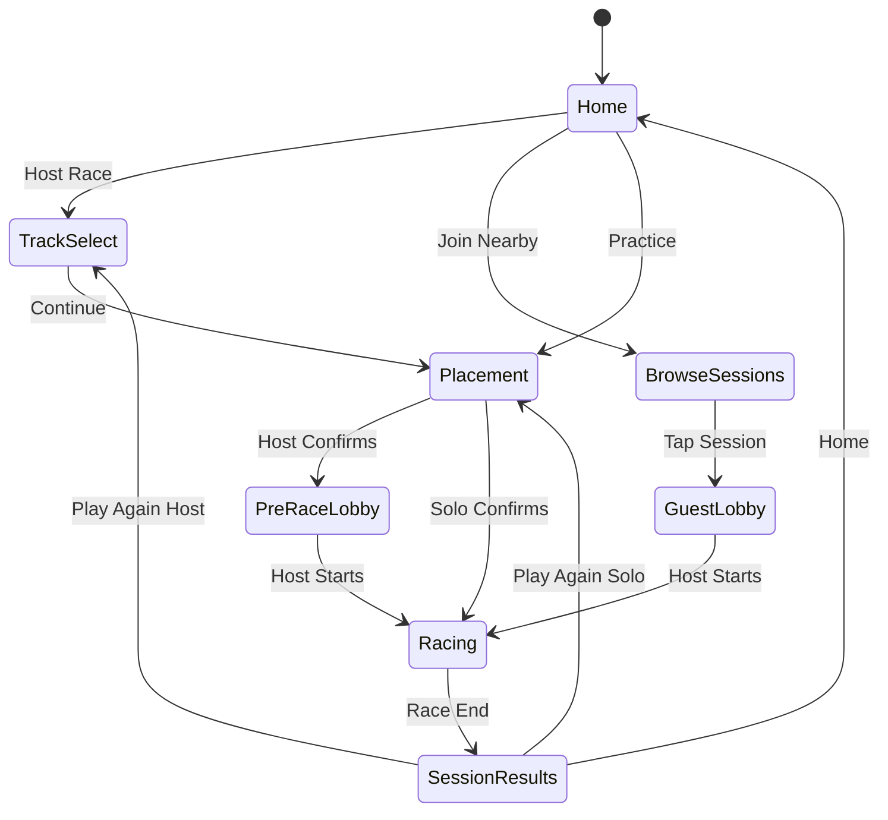
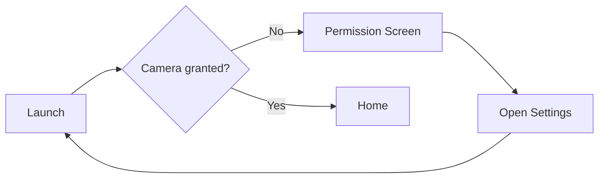

# AppFlow — Navigation & User Flows

**Project:** AR Racecar  
**Where (Navigation)**

---

## Navigation Model

The app uses a root **state machine** (`AppPhase` enum) rather than deep navigation stacks. AR (`RealityView`) stays mounted across placement → lobby → race where possible to avoid relocalization loss.

```swift
enum AppPhase {
    case home
    case trackSelect       // host only
    case browseSessions    // guest only
    case guestLobby        // guest waiting
    case placement         // AR track placement (host or solo)
    case preRaceLobby      // multiplayer ready room (host + guests)
    case racing
    case sessionResults
    case cameraPermissionDenied
    case arTrackingLost
}
```

SwiftUI root view switches on `AppPhase`; overlay HUD layers stack on top of the AR view during `placement`, `preRaceLobby`, and `racing`.

---

## Primary Flow Diagram



---

## Flow Details by Path

### 1. Solo Practice

| Step | Screen | Action | Next |
|------|--------|--------|------|
| 1 | Home | Tap **Practice** | Placement |
| 2 | Placement | Scan surface, adjust scale, **Confirm** | Racing |
| 3 | Racing | Drive laps; timer and leaderboard update | Session Results |
| 4 | Session Results | Tap **Home** or **Play Again** | Home or Placement |

**Notes:** No lobby, no MPC. Default track = last used or first preset. Default laps = 3.

---

### 2. Host Multiplayer

| Step | Screen | Action | Next |
|------|--------|--------|------|
| 1 | Home | Tap **Host Race** | Track Select |
| 2 | Track Select | Pick track, laps, day/night; **Continue** | Placement |
| 3 | Placement | Place track, **Confirm** | Pre-Race Lobby |
| 3a | — | MPC advertiser starts on entering Track Select | — |
| 4 | Pre-Race Lobby | Wait for guests; tap **Start Race** | Racing |
| 5 | Racing | Drive; host validates laps | Session Results |
| 6 | Session Results | **Home** or **Play Again** | Home or Track Select |

**Host-only controls:** Track Select, placement Confirm, Start Race, End Race early (optional).

---

### 3. Join Multiplayer (Guest)

| Step | Screen | Action | Next |
|------|--------|--------|------|
| 1 | Home | Tap **Join Nearby** | Browse Sessions |
| 2 | Browse Sessions | Tap a session row | Guest Lobby |
| 3 | Guest Lobby | Wait; track appears when host confirms placement | Racing |
| 4 | Racing | Drive when host starts | Session Results |
| 5 | Session Results | **Home** | Home |

**Guest limitations:** Cannot pick track/laps, cannot place track, cannot start race.

---

## Screen Reference

### Home

| | |
|---|---|
| **Entry** | App launch (after camera permission granted) |
| **Actions** | Practice → `placement`; Host Race → `trackSelect`; Join Nearby → `browseSessions` |
| **Exit** | Navigates to child phase |

### Track Select (Host)

| | |
|---|---|
| **Entry** | Host Race from Home |
| **Actions** | Select preset track; stepper for laps (1–99); day/night toggle; **Continue** |
| **Exit** | Continue → `placement`; Back → `home` (stops advertiser) |

### Browse Sessions (Guest)

| | |
|---|---|
| **Entry** | Join Nearby from Home |
| **Actions** | Tap session to join; Refresh; Back |
| **Exit** | Join → `guestLobby`; Back → `home` |

### Guest Lobby

| | |
|---|---|
| **Entry** | Joined a session |
| **Actions** | View players; optional color pick; Leave |
| **Exit** | Host starts → `racing`; Leave / disconnect → `home` |
| **Passive** | Receives `trackPlaced` → renders track in AR |

### AR Placement (Host / Solo)

| | |
|---|---|
| **Entry** | Track Select Continue (host) or Practice (solo) |
| **Actions** | Scan plane; drag/pinch scale; **Confirm** |
| **Exit** | Confirm → `preRaceLobby` (host) or `racing` (solo); Back → previous screen |
| **AR** | Ghost track preview until confirmed |

### Pre-Race Lobby (Host + Guests)

| | |
|---|---|
| **Entry** | Host confirms placement |
| **Actions** | Host: **Start Race**; All: optional ready toggle, color pick; Leave |
| **Exit** | Start → `racing`; Leave → `home` |

### Racing

| | |
|---|---|
| **Entry** | Race start from host or solo confirm |
| **Actions** | Joystick + gas/brake; view mini leaderboard |
| **Exit** | All players finish or host ends → `sessionResults` |
| **Overlay** | Lap counter, timer, player standings |

### Session Results

| | |
|---|---|
| **Entry** | Race end |
| **Actions** | **Home**; **Play Again** (host → Track Select, solo → Placement) |
| **Exit** | Home → `home` |

---

## Host vs Guest Capability Matrix

| Capability | Host | Guest | Solo |
|------------|------|-------|------|
| Pick track | Yes | No | Default / last |
| Pick lap count | Yes | No | Default 3 |
| Place track in AR | Yes | No | Yes |
| Browse sessions | No | Yes | No |
| Start race | Yes | No | Auto on confirm |
| Drive car | Yes | Yes | Yes |
| Validate laps | Yes (authority) | No | Local only |

---

## Error & Edge Flows

### Camera Permission Denied



- Blocking screen with explanation.
- **Open Settings** button deep-links to app settings.
- No AR functionality until granted.

### No Nearby Sessions

- **Browse Sessions** shows empty state.
- **Refresh** re-runs `MCNearbyServiceBrowser`.
- User can go Back to Home and Host instead.

### MPC Disconnect Mid-Race

| Scenario | Behavior |
|----------|----------|
| Guest disconnects | Host removes player; race continues for others |
| Host disconnects | Pause overlay: "Host disconnected"; all return Home after 5 s |
| Solo | N/A |

No host migration in v1.

### AR Tracking Lost

- Full-screen warning banner; freeze car inputs.
- Resume when tracking returns to `normal`.
- Persistent loss (> 10 s) → offer Return Home.

### Guest Joins After Track Placed

- Host re-sends `trackPlaced` on `joinAccept`.
- Guest renders track immediately in Guest Lobby.

### Back During Placement

| Role | Behavior |
|------|----------|
| Host | Confirm dialog; destroys anchor; returns to Track Select |
| Solo | Confirm dialog; returns to Home |
| Guest | N/A (guests don't place) |

### Race Already in Progress

- New browse attempts show session as "In Progress".
- Join disabled until next lobby (v1: reject join if `racePhase != lobby`).

---

## Deep Links

None for v1.

---

## Phase Transition Table

| From | Event | To |
|------|-------|-----|
| `home` | practiceTapped | `placement` |
| `home` | hostTapped | `trackSelect` |
| `home` | joinTapped | `browseSessions` |
| `trackSelect` | continued | `placement` |
| `browseSessions` | sessionJoined | `guestLobby` |
| `placement` | confirmed (solo) | `racing` |
| `placement` | confirmed (host) | `preRaceLobby` |
| `preRaceLobby` | raceStarted | `racing` |
| `guestLobby` | raceStarted | `racing` |
| `racing` | raceEnded | `sessionResults` |
| `sessionResults` | homeTapped | `home` |
| any | cameraDenied | `cameraPermissionDenied` |
| `racing` | trackingLost | `arTrackingLost` (overlay) |

---

## Related Documents

- [UI-UX.md](UI-UX.md) — Screen layouts and wireframes
- [TRD.md](TRD.md) — MPC and AR technical details
- [Backend-Schema.md](Backend-Schema.md) — Message types driving transitions
- [Impl-Plan.md](Impl-Plan.md) — Implementation order for flows
