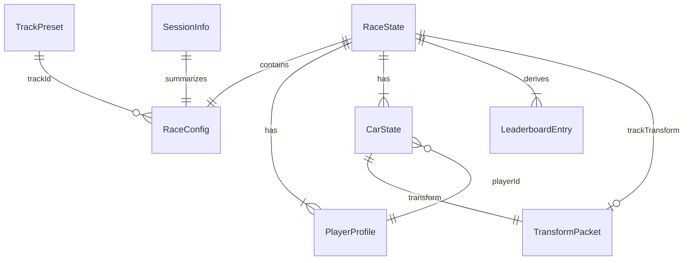

# Backend Schema — Data & Message Model

**Project:** AR Racecar  
**What (Data)**

---

## Overview

AR Racecar has **no cloud backend**. All data is **in-memory** on each device and exchanged peer-to-peer via Network framework (Bonjour + TCP). This document defines Codable entity schemas, race message types, leaderboard rules, and authority boundaries.

For wire format, messages use JSON-encoded `Codable` structs unless noted (e.g. `ARWorldMap` binary chunks).

---

## Core Entities

### TrackPreset

Static catalog entry bundled with the app.

```swift
struct TrackPreset: Codable, Identifiable {
    let id: String              // e.g. "oval-small"
    let name: String            // e.g. "Oval Classic"
    let usdzName: String        // bundle resource name without extension
    let defaultScale: Float     // e.g. 1.0
    let bounds: BoundingBox     // local-space AABB for placement preview
}

struct BoundingBox: Codable {
    let min: SIMD3<Float>
    let max: SIMD3<Float>
}
```

### RaceConfig

Set by host before placement; immutable during race.

```swift
struct RaceConfig: Codable {
    let trackId: String
    let lapCount: Int           // 1–99
    let arenaTheme: ArenaTheme
}

enum ArenaTheme: String, Codable {
    case day
    case night
}
```

### PlayerProfile

Per-peer identity for the session.

```swift
struct PlayerProfile: Codable, Identifiable {
    let peerId: String          // MCPeerID displayName or UUID
    var displayName: String
    var carColorHex: String     // e.g. "#FF3B30"
    var carScale: Float         // 0.8–1.2, default 1.0
    var isHost: Bool
}
```

### TransformPacket

Shared spatial data for track placement and car poses.

```swift
struct TransformPacket: Codable {
    var position: SIMD3<Float>  // world space
    var rotation: simd_quatf    // world orientation
    var timestamp: TimeInterval // host clock, seconds since race start or unix
}
```

### CarState

Runtime state per car, updated each physics tick locally and broadcast to peers.

```swift
struct CarState: Codable, Identifiable {
    let playerId: String
    var transform: TransformPacket
    var speed: Float            // m/s scalar
    var currentLap: Int         // 0 = not started, 1+ = in progress
    var lastLapTime: TimeInterval?
    var totalTime: TimeInterval
    var finished: Bool
    var finishTime: TimeInterval?
    var status: PlayerStatus
}

enum PlayerStatus: String, Codable {
    case waiting
    case racing
    case finished
    case disconnected
}
```

### RaceState

Authoritative on host; guests mirror for UI.

```swift
struct RaceState: Codable {
    var phase: RacePhase
    var config: RaceConfig
    var players: [PlayerProfile]
    var cars: [CarState]
    var leaderboard: [LeaderboardEntry]
    var raceStartTime: TimeInterval?
    var trackTransform: TransformPacket?
}

enum RacePhase: String, Codable {
    case idle
    case placing
    case lobby
    case countdown
    case racing
    case finished
}
```

### SessionInfo

Advertised by host for browse UI (small payload).

```swift
struct SessionInfo: Codable, Identifiable {
    let sessionId: String
    let hostName: String
    let trackId: String
    let lapCount: Int
    let playerCount: Int
    let maxPlayers: Int         // default 4
    let phase: RacePhase        // only joinable if .lobby or .placing
}
```

### LeaderboardEntry

Derived from `CarState` array; recomputed on lap events and each second during race.

```swift
struct LeaderboardEntry: Codable, Identifiable {
    let rank: Int
    let playerId: String
    let displayName: String
    let currentLap: Int
    let lastLapTime: TimeInterval?
    let totalTime: TimeInterval
    let status: PlayerStatus
}
```

---

## Leaderboard Sort Rules

Sort `CarState` into `LeaderboardEntry` using this comparator (stable sort):

1. **Finished players first**, ordered by `finishTime` ascending (earlier finish = better rank).
2. Among non-finished: higher `currentLap` wins.
3. Tie on lap: lower `totalTime` wins (further along current lap).
4. Tie still: higher `speed` or distance-along-track (host computes `distanceAlongTrack` from checkpoint spline).

Display fields: rank, name, `currentLap` / `config.lapCount`, last lap time, total elapsed time, status badge.

**Session-only:** Leaderboard is discarded when returning Home. No persistence.

---

## Race Message Envelope

All messages share a wrapper for routing and versioning. Payloads are sent over TCP as **length-prefixed JSON** (`UInt32` big-endian length + `RaceEnvelope` JSON).

```swift
struct RaceEnvelope: Codable {
    let version: Int            // 1
    let type: RaceMessageType
    let payload: Data           // JSON of specific payload struct
    let senderId: String
    let timestamp: TimeInterval
}

enum RaceMessageType: String, Codable {
    case sessionAdvertise
    case joinRequest
    case joinAccept
    case trackPlaced
    case worldMapChunk
    case playerProfile
    case playerReady
    case raceStart
    case raceEnd
    case carPose
    case lapCompleted
    case playerFinished
    case playerLeft
    case raceStateSync
}
```

---

## Message Payloads

### sessionAdvertise

Host advertises via Bonjour TXT records on `_racecar-ar._tcp`. Guest browses and opens a TCP connection to the host.

```swift
struct SessionAdvertisePayload: Codable {
    let sessionInfo: SessionInfo
}
```

### joinRequest / joinAccept

```swift
struct JoinRequestPayload: Codable {
    let player: PlayerProfile
}

struct JoinAcceptPayload: Codable {
    let player: PlayerProfile          // assigned slot
    let raceState: RaceState           // snapshot for sync
    let allPlayers: [PlayerProfile]
}
```

### trackPlaced

Host → all guests after AR confirm.

```swift
struct TrackPlacedPayload: Codable {
    let presetId: String
    let transform: TransformPacket
    let scale: Float
}
```

### worldMapChunk (optional enhancement)

```swift
struct WorldMapChunkPayload: Codable {
    let chunkIndex: Int
    let totalChunks: Int
    let data: Data                     // ARWorldMap archived bytes fragment
}
```

### playerProfile / playerReady

```swift
struct PlayerProfilePayload: Codable {
    let player: PlayerProfile
}

struct PlayerReadyPayload: Codable {
    let playerId: String
    let isReady: Bool
}
```

### raceStart / raceEnd

```swift
struct RaceStartPayload: Codable {
    let startTime: TimeInterval          // host timestamp for countdown sync
    let config: RaceConfig
}

struct RaceEndPayload: Codable {
    let leaderboard: [LeaderboardEntry]
    let reason: RaceEndReason
}

enum RaceEndReason: String, Codable {
    case allFinished
    case hostEnded
    case hostDisconnected
}
```

### carPose (high frequency, unreliable)

```swift
struct CarPosePayload: Codable {
    let playerId: String
    let transform: TransformPacket
    let speed: Float
}
```

Target: 10–20 messages/second per peer. Payload ≈ 80–120 bytes JSON.

### lapCompleted / playerFinished

```swift
struct LapCompletedPayload: Codable {
    let playerId: String
    let lapNumber: Int
    let lapTime: TimeInterval
    let totalTime: TimeInterval
}

struct PlayerFinishedPayload: Codable {
    let playerId: String
    let finishTime: TimeInterval
    let finalRank: Int
}
```

**Authority:** Host validates lap events (checks trigger volume crossing) before broadcasting updated `raceStateSync`.

### playerLeft

```swift
struct PlayerLeftPayload: Codable {
    let playerId: String
    let reason: String                 // "disconnect" | "quit"
}
```

### raceStateSync

Full or partial state for recovery.

```swift
struct RaceStateSyncPayload: Codable {
    let raceState: RaceState
}
```

---

## Authority Rules

| Data | Authoritative peer | Notes |
|------|-------------------|-------|
| `RaceConfig` | Host | Set at Track Select |
| `trackTransform` | Host | Set at placement confirm |
| `RacePhase` transitions | Host | lobby → racing → finished |
| `lapCompleted` validation | Host | Guests request; host confirms |
| `leaderboard` | Host | Host computes and broadcasts |
| `carPose` (own car) | Each client | Local physics; host trusts for display |
| `PlayerProfile` (own) | Each client | Broadcast on change |

### Cheat mitigation (v1)

- Host validates lap trigger crossings before accepting `lapCompleted`.
- Guests cannot send `raceStart` or `trackPlaced`.
- Finish order determined by host-validated `playerFinished` events.

---

## Entity Relationship Diagram



---

## Local Storage (Minimal)

| Key | Storage | Purpose |
|-----|---------|---------|
| `displayName` | UserDefaults | Player name in lobby |
| `lastTrackId` | UserDefaults | Solo mode default track |
| `lastLapCount` | UserDefaults | Solo mode default laps |

No race history, no cloud sync.

---

## Future Extension Points

If persistent global leaderboards are added later:

- Add `RaceResult` record: `sessionId`, `trackId`, `playerId`, `finishTime`, `timestamp`.
- Backend options: CloudKit, Firebase Firestore, or custom API.
- Current `LeaderboardEntry` maps directly to a `RaceResult` row.

---

## Related Documents

- [TRD.md](TRD.md) — Network framework architecture and channel usage
- [AppFlow.md](AppFlow.md) — When messages trigger navigation
- [Impl-Plan.md](Impl-Plan.md) — Schema implementation order
