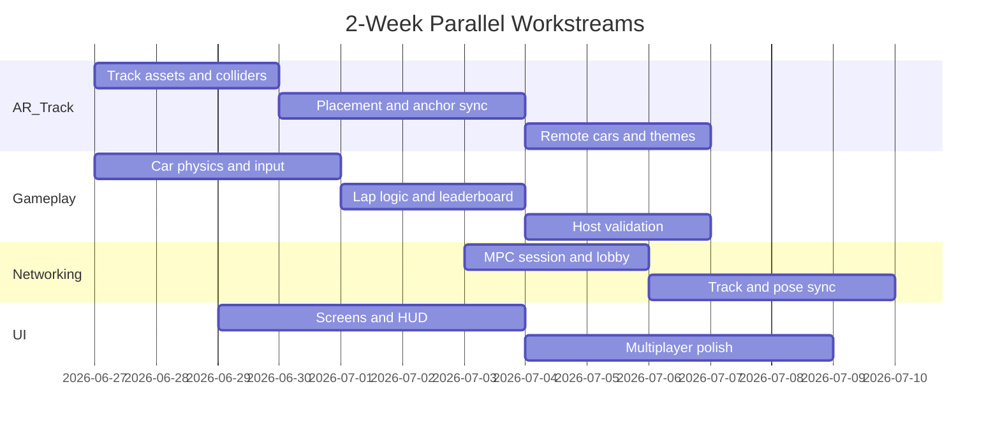
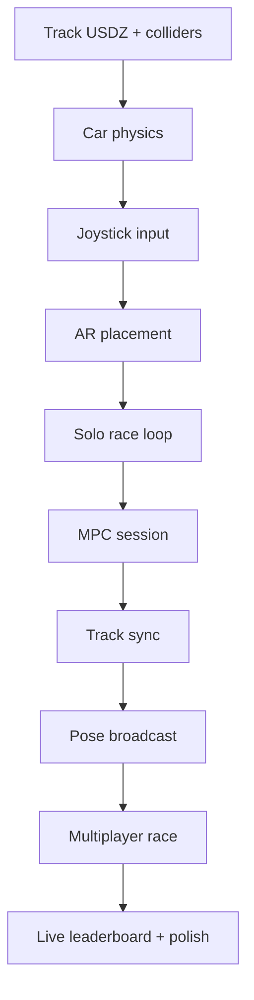

# Implementation Plan

**Project:** AR Racecar  
**When (Order)**

---

## Summary

| Parameter | Value |
|-----------|-------|
| Timeline | ~2 weeks (10 working days) |
| Team | 3–5 developers |
| Demo target | Solo practice + 2–4 player local multiplayer |
| Starting point | SwiftUI + RealityKit AR cube template |

**Strategy:** Week 1 delivers all **Must-have** features in single-player. Week 2 adds **Should-have** multiplayer, lobby, and session leaderboard. **Could-have** items are explicitly deferred post-deadline.

---

## MoSCoW → Sprint Mapping

| Priority | Features | Target |
|----------|----------|--------|
| **Must** | Track, walls/physics, AR placement, car-on-track, controls | End of Week 1 |
| **Should** | Scaling, lobby, MPC, leaderboard, timer/laps, presets, indicators, haptics, day/night, customization | End of Week 2 |
| **Could** | Caster voice, engine audio, victory screen, bombs, lights, boost | Post-deadline stretch |

---

## Week 1 — Playable Single-Player (Must-Haves)

**Milestone:** Solo practice race on a placed track with lap timer and session leaderboard.

### Days 1–2: Foundation & Track

| Task | Details | Owner |
|------|---------|-------|
| Create folder structure | Per [TRD.md](TRD.md) module layout | All |
| Add first track USDZ | Import preset track with mesh colliders | AR |
| Wall colliders | Static physics bodies on track boundaries | AR |
| Car model | Load car entity; attach to track at start position | AR |
| Replace cube in ContentView | Wire `ARSceneController` into `RealityView` | AR |
| Define `TrackPreset` model | Bundle catalog with 1 track | Models |

**Deliverable:** Track and car visible in AR on detected plane (fixed placement, no user confirm yet).

### Days 2–3: Car Control & Physics

| Task | Details | Owner |
|------|---------|-------|
| Virtual joystick UI | `VirtualJoystick` SwiftUI component | UI / Input |
| Gas / brake buttons | Right-side hold buttons | UI / Input |
| Input → force mapping | `CarInputMapper` applies thrust/yaw | Input |
| Physics tuning | Mass, friction, wall bounce feel | Game |
| Car-on-track constraint | Raycast snap + boundary recovery | Game / AR |
| Camera follow | Soft follow behind local car | AR |

**Deliverable:** Drive car around track with joystick; walls block exit.

### Days 3–4: AR Placement & Race Loop

| Task | Details | Owner |
|------|---------|-------|
| Placement flow | Ghost preview, reticle, scale slider | AR / UI |
| Confirm anchor | Lock `AnchorEntity` on confirm | AR |
| Solo flow wiring | Home → Practice → Placement → Race | UI |
| Start/finish triggers | Volume entities for lap detection | Game |
| Lap counter & timer | `LapDetector` + elapsed time display | Game |
| `RaceConfig` | Default 3 laps; configurable in code | Models |

**Deliverable:** Full solo loop from Home through placement to finish.

### Days 4–5: Polish & Session Leaderboard

| Task | Details | Owner |
|------|---------|-------|
| Session results screen | Standings, times, Home / Play Again | UI |
| Leaderboard sort | Implement rules from [Backend-Schema.md](Backend-Schema.md) | Game |
| Camera permission string | Replace placeholder in build settings | All |
| Second track preset | Add 1 more layout for variety | AR |
| Bug fixes & tuning | Physics, placement edge cases | All |

**Week 1 exit criteria:**
- [ ] Solo: place track, drive, complete N laps, see results
- [ ] Car stays on track; walls work
- [ ] No crash in 5-minute solo session

---

## Week 2 — Multiplayer & Should-Haves

**Milestone:** 2–4 player local race with shared track and live standings.

### Days 6–7: MPC & Lobby

| Task | Details | Owner |
|------|---------|-------|
| `MPCSessionManager` | Advertiser, browser, session delegate | Net |
| `MPCMessageCodec` | Envelope encode/decode per schema | Net / Models |
| Home screen | Practice / Host / Join buttons | UI |
| Browse sessions UI | List `SessionInfo`, tap to join | UI |
| Host Track Select | Preset picker, lap stepper, day/night | UI |
| Pre-race lobby | Player list, connection status | UI |
| `PlayerProfile` sync | joinRequest / joinAccept flow | Net |

**Deliverable:** Devices discover each other; guests join host lobby.

### Days 7–8: Track Sync

| Task | Details | Owner |
|------|---------|-------|
| Host placement confirm | Send `trackPlaced` message | Net / AR |
| Guest track render | Instantiate track from received transform | AR |
| Alignment testing | 2-device visual alignment check | QA |
| Recenter fallback | Host button to re-send transform | AR / UI |
| Optional: ARWorldMap chunk | If LiDAR host + time permits | Net / AR |

**Deliverable:** Guest sees host-placed track in aligned position.

### Days 8–9: Multi-Car Race Sync

| Task | Details | Owner |
|------|---------|-------|
| `carPose` broadcast | Unreliable 10–20 Hz | Net |
| Remote car entities | Spawn peer cars; interpolate poses | AR / Game |
| Host race start | `raceStart` message; phase transition | Net / Game |
| Host lap validation | Validate and broadcast `lapCompleted` | Game |
| `raceEnd` + sync | Final leaderboard to all peers | Net |
| Player indicators | Name tags + color rings | UI / AR |

**Deliverable:** Full multiplayer race from lobby to results.

### Days 9–10: Should-Haves & Demo Prep

| Task | Details | Owner |
|------|---------|-------|
| Live mini leaderboard | HUD standings during race | UI |
| Haptic feedback | Wall hit, lap, start, finish | UI |
| Day / night theme | Environment toggle on Track Select | AR |
| Car color picker | Lobby color selection | UI |
| Dynamic scaling polish | Pinch + slider on placement | AR / UI |
| Multi-device testing | 3–4 phones, Wi-Fi conditions | QA |
| Demo script | 3-minute presenter flow | All |
| Bug bash & fixes | Disconnect handling, tracking loss | All |

**Week 2 exit criteria:**
- [ ] Host: pick track/laps, place, start race with 2+ guests
- [ ] All players drive simultaneously; see each other's cars
- [ ] Live leaderboard updates during race
- [ ] Session results show correct order
- [ ] Stable on non-LiDAR iPhone

---

## Post-Deadline Stretch

Implement only after demo-ready build is frozen.

| Item | Priority | Estimate |
|------|----------|----------|
| Car size customization | Should remainder | 0.5 day |
| ARWorldMap sync (LiDAR) | Enhancement | 1–2 days |
| Victory screen (Could) | Stretch | 0.5 day |
| Starting lights (Could) | Stretch | 0.5 day |
| Boost / turbo (Could) | Stretch | 1 day |
| Bombs (Could) | Stretch | 1–2 days |
| Spatial caster voice (Could) | Stretch | 1–2 days |
| 3D engine audio (Could) | Stretch | 1 day |

---

## Team Parallelization

| Role | Week 1 focus | Week 2 focus |
|------|--------------|--------------|
| **AR / Track** | USDZ, colliders, placement, camera | Track sync, remote cars, day/night |
| **Gameplay** | Physics, lap detection, leaderboard sort | Host validation, race state machine |
| **Networking** | — (schema stubs only) | MPC manager, all message types |
| **UI** | Joystick, solo flow, results | Lobby, browse, HUD, haptics |
| **QA / Integration** | Solo testing | Multi-device, demo script |

---

## Dependency Graph

**Critical path:** Track → physics → placement → MPC → track sync → pose sync → demo.

---

## Risks & Mitigations

| Risk | Impact | Mitigation |
|------|--------|------------|
| AR drift between devices | Guests see misaligned track | Transform sync + recenter button; short races |
| MPC unreliability at 6+ peers | Laggy or dropped poses | Cap at 4 players; unreliable for poses only |
| Physics tuning takes too long | Driving feels bad | Lock tuning by Day 3; iterate only if blocking |
| Scope creep on Could-haves | Miss multiplayer demo | Freeze Could-haves until Day 10 criteria met |
| No LiDAR on test devices | Weaker relocalization | Default to transform sync (no LiDAR required) |
| USDZ track not ready | Blocks everything | Day 1: placeholder oval from primitives if needed |

---

## Definition of Done (Class Demo)

1. **Single-player:** Practice mode with AR placement, joystick driving, laps, and results.
2. **Multiplayer:** Host creates session; guests browse and join; host places track; all see aligned course.
3. **Racing:** Simultaneous driving; live session leaderboard; correct finish order.
4. **Stability:** No crash in 5-minute session with 2–4 players.
5. **Devices:** Works on iPhone/iPad with and without LiDAR.
6. **Documentation:** All six `docs/` files complete and consistent.

---

## Daily Standup Checklist

- [ ] What moved on the critical path yesterday?
- [ ] Any blocker on track, MPC, or physics?
- [ ] How many devices tested together last session?
- [ ] Are we on track for this week's milestone?

---

## Related Documents

- [PRD.md](PRD.md) — Feature scope
- [TRD.md](TRD.md) — Architecture
- [Backend-Schema.md](Backend-Schema.md) — Data models to implement on Days 1 and 6
- [AppFlow.md](AppFlow.md) — Screens to wire each week
- [UI-UX.md](UI-UX.md) — Visual specs for UI tasks
