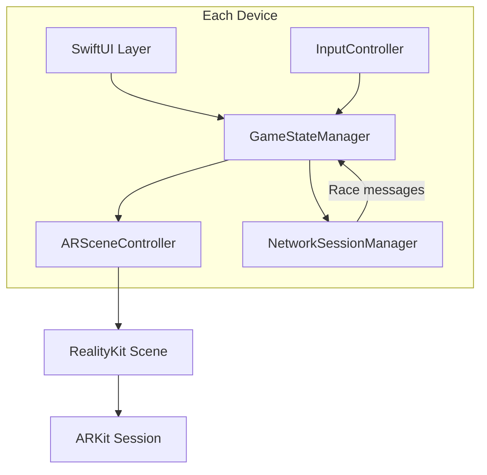
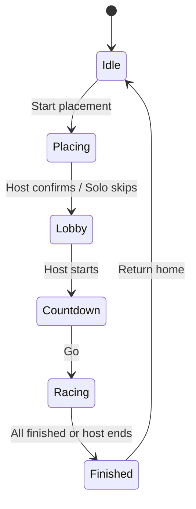

# TRD — Technical Requirements Document

**Project:** AR Racecar  
**How (Technical)**

---

## Overview

AR Racecar is a native iOS app built on the existing SwiftUI + RealityKit template. It adds AR track placement, physics-based car driving, local multiplayer via Network framework (Bonjour + TCP), and a host-authoritative race state machine. There is no cloud backend.

---

## Technology Stack

| Layer | Technology | Role |
|-------|------------|------|
| UI | SwiftUI | Screens, HUD overlays, lobby, joystick |
| 3D / AR | RealityKit | Track, cars, physics, `RealityView` |
| Tracking | ARKit (via RealityKit) | Plane detection, world tracking, optional `ARWorldMap` |
| Networking | Network framework (`NWListener`, `NWBrowser`, `NWConnection`) | Bonjour discovery, host-listener / guest-client TCP |
| Lifecycle | UIKit | [`AppDelegate`](../racecar/AppDelegate.swift), [`SceneDelegate`](../racecar/SceneDelegate.swift) |
| Serialization | `Codable` + JSON | Race message payloads over length-prefixed TCP frames (see [Backend-Schema.md](Backend-Schema.md)) |
| Haptics | `UIImpactFeedbackGenerator` | Wall hits, race start/end |

**Not used in v1:** SceneKit, GameKit, CloudKit, Firebase, custom REST/WebSocket server.

---

## System Architecture



### Layer Responsibilities

| Module | Responsibility |
|--------|----------------|
| **UI** | Navigation, lobby, placement overlays, race HUD, results |
| **GameStateManager** | Race phase machine, lap logic, leaderboard sort, host authority |
| **ARSceneController** | `RealityView` lifecycle, anchor management, track/car entities |
| **InputController** | Virtual joystick → thrust/steering vectors |
| **NetworkSessionManager** | Host listener, guest browser, TCP connect, length-prefixed message send/receive |

---

## Proposed Project Structure

Target layout (not yet implemented):

```
racecar/
  App/
    AppDelegate.swift
    SceneDelegate.swift
  AR/
    ARSceneController.swift
    TrackLoader.swift
    AnchorManager.swift
  Game/
    GameStateManager.swift
    RacePhase.swift
    LapDetector.swift
    LeaderboardSorter.swift
  Input/
    VirtualJoystick.swift
    CarInputMapper.swift
  Multiplayer/
    NetworkSessionManager.swift
    LengthPrefixedMessageCodec.swift
  UI/
    HomeView.swift
    LobbyView.swift
    PlacementView.swift
    RaceHUDView.swift
    ResultsView.swift
  Models/
    TrackPreset.swift
    RaceConfig.swift
    PlayerProfile.swift
    CarState.swift
    RaceMessage.swift
  Resources/
    Tracks/          # .usdz preset tracks
    Cars/            # .usdz car models
```

---

## AR Track Placement & Sync

### Host-Authoritative Placement Flow

1. Host enters AR placement mode; app detects horizontal planes.
2. Ghost track preview follows plane reticle; host adjusts position, rotation, and scale.
3. Host taps **Confirm** → track anchor is fixed in host's AR world.
4. Host sends `trackPlaced` message (preset ID, transform, scale) to all guests.
5. Guests instantiate the same preset at the received transform relative to their AR origin.

### Sync Options

| Approach | How it works | Pros | Cons |
|----------|--------------|------|------|
| **A. Host-relative transform sync** *(recommended v1)* | Host sends `Transform` + preset ID after placement | Simple; small payloads; no LiDAR required | Drift if devices move independently; may need recenter |
| **B. ARWorldMap handoff** | Host exports `ARWorldMap`, chunks over TCP; guests relocalize | Better alignment on similar environment scans | Large payload; slow join; LiDAR improves quality |
| **C. Image / QR anchor** | Printed marker on table defines shared origin | Very stable origin | Extra setup; UX friction for casual play |

### Recommendation

- **v1 default:** Approach **A** — host-relative transform sync.
- **Enhancement (if time):** Approach **B** on LiDAR-capable host devices when guest join latency is acceptable.
- **Fallback UI:** "Recenter track" button on host if drift is noticed.

### Anchor Implementation

```swift
// Conceptual: host creates world anchor after confirm
let trackAnchor = AnchorEntity(world: transform)
trackAnchor.addChild(trackEntity)
arView.scene.addAnchor(trackAnchor)
```

Guests recreate the same anchor from the synced `TransformPacket` (see [Backend-Schema.md](Backend-Schema.md)).

---

## Car-on-Track Constraint

Cars must stay on the track surface and within wall boundaries.

| Mechanism | Detail |
|-----------|--------|
| Surface snap | Each frame, raycast downward from car to track mesh; set Y to hit point |
| Wall collision | `PhysicsBodyComponent` on car (dynamic); static colliders on track walls |
| Off-track recovery | If car leaves bounds, respawn at last valid checkpoint or slow reset |
| Steering plane | Joystick input mapped to forces on the track's local XZ plane |

---

## Physics

| Component | Setting |
|-----------|---------|
| Car body | Dynamic `PhysicsBodyComponent`, mass ~1–3 kg (tuned) |
| Track walls | Static colliders, restitution ~0.3 for bounce |
| Friction | High friction on track surface material to prevent ice-skating |
| Update rate | Physics at 60 Hz; pose broadcast at 10–20 Hz |

### Input Mapping

```
joystick.x  → yaw torque or lateral steer force
joystick.y  → forward/backward thrust (gas/brake buttons boost/decrease)
```

---

## Multiplayer Architecture

### Session Model

- **Discovery:** `MCNearbyServiceAdvertiser` (host) + `MCNearbyServiceBrowser` (guest).
- **Service type:** `racecar-ar` (≤ 15 chars, lowercase).
- **Encryption:** `MCEncryptionRequired`.
- **Max peers:** Recommend **4** connected players; test up to 6–8 with degraded pose rate.

### Authority Model

| Data | Owner |
|------|-------|
| Race config (track, laps, theme) | Host |
| Track anchor transform | Host |
| Race phase transitions (lobby → racing → results) | Host |
| Lap validation / finish order | Host |
| Local car input | Each client |
| Own car physics simulation | Each client (own car) |
| Remote car display | Interpolated from received `carPose` messages |

### Data Channels

| Channel | Use | Frequency |
|---------|-----|-----------|
| Reliable (`sendData` reliable) | Join, track placed, race start/end, lap events | Event-driven |
| Unreliable | `carPose` position/rotation updates | 10–20 Hz per peer |

### Remote Car Interpolation

Guests receive peer `carPose` messages and lerp remote car entities toward reported transforms to smooth network jitter. Own car uses local physics (client-side prediction for driver).

---

## Race State Machine



**Lap detection:** Trigger volume entities at start/finish line; host validates `lapCompleted` events to prevent cheating.

---

## Single-Player Mode

Same AR placement and race loop without multiplayer networking:

- Skip lobby and browse screens.
- No pose broadcast; one car entity only.
- Session leaderboard shows single player stats (useful for testing lap logic).

---

## Performance Targets

| Target | Value |
|--------|-------|
| Frame rate | 60 FPS on iPhone 12+ class devices |
| AR tracking | Maintain `normal` tracking state during race |
| Network latency | < 50 ms on local Wi-Fi for reliable messages |
| Pose packet size | < 128 bytes per `carPose` |

---

## Security & Privacy

- Local network only; no data leaves the device except peer-to-peer TCP over Bonjour.
- Camera used only for AR; no recording or upload.
- Display name stored in `UserDefaults` locally (optional).

---

## Out of Scope (TRD)

- Cloud backend, accounts, persistent leaderboards
- Game Center integration
- Android / cross-platform
- Anti-cheat beyond host-authoritative lap validation

---

## Related Documents

- [PRD.md](PRD.md) — Feature priorities
- [Backend-Schema.md](Backend-Schema.md) — Message and entity schemas
- [AppFlow.md](AppFlow.md) — Screen navigation
- [Impl-Plan.md](Impl-Plan.md) — Build order
